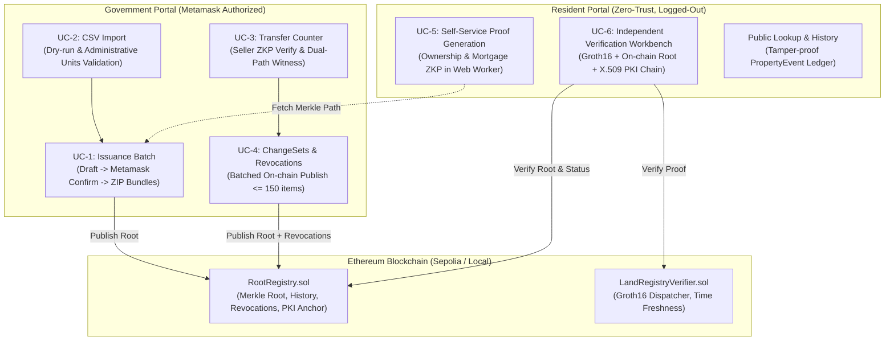

# Land Registry ZKP

> **Master's Thesis Project**: Application of Blockchain in Real Estate Management  
> **Focus**: Privacy-Preserving Land Use Rights (LUR) Registry using **Sparse Merkle Trees + Zero-Knowledge Proofs (Groth16)** on Ethereum  
> **Jurisdiction Alignment**: Compliant with statutory requirements of the **Vietnam Land Law 2024**, Decree 151/2025/ND-CP, and Circular 08/2024/TT-BTNMT.

Land records live off-chain; only the **Merkle root** is anchored on-chain. Landowners prove cryptographic assertions about their property — _"I am the legitimate title holder"_, _"this title is unencumbered and has at least N years of remaining tenure"_, _"ownership transferred from party A to party B"_ — without disclosing the underlying record, owner identity, or exact property boundaries.

---

## Architecture Overview

The system is organized as a unified monorepo managed with **pnpm workspaces**:

```
land-registry-zkp/
├── blockchain/          # Cryptographic layer: circom circuits, Hardhat contracts, shared ZKP logic
│   ├── circuits/        # Circom 2.2.3 circuits (ownership, mortgage, transfer, +3 shared templates)
│   ├── contracts/       # Solidity 0.8.24+ (RootRegistry, LandRegistryVerifier, generated verifiers)
│   ├── deployments/     # Deployed contract artifacts on Ethereum Sepolia and local networks
│   ├── scripts/         # Automated scripts for circuits compilation, trusted setup, deploy, benchmarks
│   └── shared/          # Single Source of Truth: Poseidon hashing, sparse tree, types, leaf order
├── web-app/
│   ├── backend/         # NestJS 10 API: Prisma 7 ORM, PostgreSQL 16 (merkle_nodes, properties, events),
│   │                    # X.509 PKI issuer service, DejaVu Sans PDF engine, streaming ZIP bundles
│   └── frontend/        # Next.js 16 (App Router) + React 19 + Tailwind CSS + wagmi/RainbowKit:
│                        # - Government Portal: issuance, dry-run imports, transfers, batch change sets
│                        # - Resident Portal: zero-trust client-side Groth16 prover & verifier workbench
├── pki/                 # Government Root CA and X.509 certificate generation scripts
└── docker-compose.yml   # PostgreSQL 16 on host port 5433
```

### Core Design Principles

1. **Zero Crypto Duplication**: All Merkle tree operations, Poseidon hashing, and canonical leaf formatting live exclusively in `blockchain/shared/`. Both `backend` and `frontend` import them directly from `@land-registry/blockchain/shared` — preventing silent drift between off-chain computations and on-chain verifications.
2. **Zero-Trust Verification**: The Resident Verification Workbench (UC-6) validates proofs independently in the client browser using `snarkjs` and direct Ethereum RPC reads (`eth_call`). It never asks the backend whether a proof is valid.
3. **Double-Spending & Stale-Leaf Prevention (D41)**: A plot's leaf slot in the sparse Merkle tree is strictly bound to its `propertyId` (`0 <= propertyId < 2^24`). A single slot holds exactly one valid leaf at any time; once transferred or revoked, the previous leaf has no valid path to the new root.
4. **HCMC-Scale Tree (D71, D72)**: Tree depth is fixed at **24** (`16,777,216` addressable slots), offering 6.7x headroom for Ho Chi Minh City's 2.5 million parcels. Stored in a PostgreSQL `merkle_nodes` table, Merkle proof retrieval requires only 24 primary-key lookups (`O(depth)`), completely eliminating whole-tree rebuilds.

### Companion Documentation

| Document                                                             | Description                                                                              |
| -------------------------------------------------------------------- | ---------------------------------------------------------------------------------------- |
| [`DEPLOYMENT.md`](./DEPLOYMENT.md)                                   | Deployment runbook: local node -> Sepolia trial -> Sepolia production, plus gas analysis |
| [`CODING_ROADMAP.md`](./CODING_ROADMAP.md)                           | Locked technical design, circuit layout, and binding Design Decisions Log (D1–D82)       |
| [`THESIS_IMPLEMENTATION_GUIDE.md`](./THESIS_IMPLEMENTATION_GUIDE.md) | Academic framing, evaluation criteria, and defense alignment                             |
| [`CLAUDE.md`](./CLAUDE.md)                                           | Technical instructions, workspace layout, and developer CLI references                   |

---

## Six Core Use Cases (UC-1 … UC-6)

Modelled after the Vietnamese land administration procedure and aligned with **IU-SmartCert**:



- **UC-1: First-Time Land Use Rights Issuance**  
  Cadastral officers create an issuance draft. The backend generates cryptographic secrets (`ownerSecret`, 248-bit entropy) and commitments, builds the new sparse Merkle tree, and awaits officer authorization via Metamask. Upon confirmation, the new root is published on-chain, and an issuance archive ZIP is generated containing `receipt.json`, `secret.json`, and an official electronic certificate PDF (with Vietnamese font subsetting via DejaVu Sans).
- **UC-2: Land Data Import & Cadastral Validation**  
  Bulk CSV ingestion with a mandatory 2-phase dry-run mode. Validates cadastral boundaries against official commune/ward reference data (`administrative_units`, Decree 151/2025/ND-CP) and checks legal land-use tenure according to the 2024 Land Law (Articles 171 and 172).
- **UC-3: Land Transfer Counter & In-Person Verification**  
  In-person administrative workflow. The officer verifies the seller's cryptographic bundle, generates the dual-path transfer witness (`oldSiblings` and `newSiblings`), provisions the buyer's secret and commitment, and enqueues the transfer for batched execution.
- **UC-4: Changesets & Administrative Revocations**  
  Batched periodic publication of approved transfers and administrative revocations. Revoked titles are cryptographically zeroed in the Merkle tree and recorded on-chain in `RootRegistry` with standardized reason codes and hashed details (capped at 150 items per transaction to operate well within Ethereum block gas limits).
- **UC-5: Resident Self-Service Proof Generation**  
  Landowners generate Groth16 zero-knowledge proofs directly in their web browser inside a background Web Worker. Proves ownership or unencumbered status with custom remaining tenure thresholds without revealing identity, exact term, or encumbrance status.
- **UC-6: Independent Zero-Trust Verification Workbench**  
  Third parties (commercial banks, prospective buyers, notaries) verify proofs against the live blockchain. Executes 4 checks sequentially: proof timestamp freshness (+/- 10 minutes), Groth16 cryptographic correctness, on-chain Merkle root match, and X.509 issuer certificate validation against a pinned Government Root CA.

---

## Cryptographic & Security Architecture

### 1. Canonical 7-Field Poseidon Leaf Hash (D4, D36)

Every land record is committed to a single BN254 scalar leaf via Poseidon hashing:

```text
leaf = Poseidon([propertyId, ownerCommitment, useType, validityPeriod, encumbranceStatus, tenureType, offchainHash])
```

- `propertyId`: Integer ID of the land parcel (`0 <= propertyId < 2^24`).
- `ownerCommitment`: `Poseidon([ownerSecret])`.
- `useType`: Land use category (`1` = Residential, `2` = Agricultural, `3` = Non-agricultural commercial, etc.).
- `validityPeriod`: Unix epoch timestamp deadline (`0` sentinel for perpetual tenure).
- `encumbranceStatus`: `0` = FREE, `1` = MORTGAGED, `2` = LITIGATED / DISPUTED.
- `tenureType`: `0` = PERPETUAL (stable long-term land use), `1` = FIXED_TERM (statutory finite term, e.g., 50 years), `2` = PROJECT_LEASEHOLD (investment project lease, e.g., up to 50 or 70 years).
- `offchainHash`: Length-prefixed canonical SHA-256 hash modulo BN254 field of the 8 descriptive fields (`certificateSerial`, `bookEntryNumber`, `address`, `area`, `issuingAuthority`, `issueDate`, `mapSheetNumber`, `landOrigin`). Prevents tampering with printed certificate metadata while maintaining zero on-chain storage overhead.

### 2. Circom Circuits & Constraints

Compiled using **Circom 2.2.3** and proven via **snarkjs (Groth16)** with public Hermez Powers-of-Tau ceremony files:

| Circuit            | Purpose                                                                     | Non-linear Constraints | Total Constraints | Public Signals                                                                                                                                 | Setup PTAU |
| ------------------ | --------------------------------------------------------------------------- | ---------------------- | ----------------- | ---------------------------------------------------------------------------------------------------------------------------------------------- | ---------- |
| `ownership.circom` | Proves valid ownership and unexpired term without disclosing owner identity | 6,741                  | 14,270            | 4 (`merkleRoot`, `propertyId`, `ownerCommitment`, `currentTimestamp`)                                                                          | `2^14`     |
| `mortgage.circom`  | Proves title is clean (`FREE`) and remaining tenure >= threshold            | 6,741                  | 14,270            | 5 (`merkleRoot`, `propertyId`, `ownerCommitment`, `currentTimestamp`, `minRequiredRemainingTerm`)                                              | `2^14`     |
| `transfer.circom`  | Proves dual Merkle transition: old owner -> new owner at the same slot      | 13,221                 | 28,271            | 7 (`oldMerkleRoot`, `newMerkleRoot`, `propertyId`, `oldOwnerCommitment`, `newOwnerCommitment`, `currentTimestamp`, `minRequiredRemainingTerm`) | `2^15`     |

### 3. Anti-Replay & Freshness Guard (D9, D26)

Provers supply `currentTimestamp` as a public input. Both `LandRegistryVerifier.sol` and the off-chain verification workbench enforce:

```text
|currentTimestamp - block.timestamp| <= 600 seconds (10 minutes)
```

This invalidates back-dated or captured proofs while allowing for normal client-server clock drift.

### 4. PKI Identity Anchoring (D30, D78)

To prevent rogue entities from deploying dummy registries, the system implements a two-tier PKI:

1. A **Government Root CA** (`pki/root-ca.cert.pem`) issues certificates to municipal land authorities (`So Tai nguyen va Moi truong TP.HCM` / Department of Natural Resources and Environment).
2. The Subject Organization name is cryptographically hashed on-chain: `authorityInstitute[publisher] = keccak256("So Tai nguyen va Moi truong TP.HCM")`.
3. Verifiers in the resident portal validate the X.509 certificate chain against the pinned Government Root CA, verify the publisher's digital signature over their Ethereum address, and confirm their on-chain authority role.

---

## Current Status & Verification Metrics

Phases 0 through 11 are fully completed, tested, and evaluated:

| Phase  | Description                                                                               | Status       |
| ------ | ----------------------------------------------------------------------------------------- | ------------ |
| **0**  | Cadastral mock data generator, Vietnam UTC+7 calendar utilities                           | ✅ Completed |
| **1**  | Merkle tree layer: Poseidon hash, hand-written fixed-depth-24 sparse tree                 | ✅ Completed |
| **2**  | Circom 2.2.3 circuits (`ownership`, `mortgage`, `transfer` + common templates)            | ✅ Completed |
| **3**  | Trusted setup: Groth16 Phase-2 ceremony, automated verifier sync, E2E test                | ✅ Completed |
| **4**  | Smart contracts: `RootRegistry`, `LandRegistryVerifier`, Hardhat deploy scripts           | ✅ Completed |
| **5**  | Backend core: LUR management, issuance batches, DejaVu Sans PDF engine, ZIP archive       | ✅ Completed |
| **6**  | Proof API: Merkle proof generation, on-chain/off-chain verification                       | ✅ Completed |
| **7**  | Realignment to UC-1…UC-6 flow (SmartCert-aligned, 2-phase draft confirmation)             | ✅ Completed |
| **8**  | Frontend Government Portal (UC-1 issuance, UC-2 import, UC-3 transfers, UC-4 changes)     | ✅ Completed |
| **9**  | Frontend Resident Portal (UC-5 client-side prover, UC-6 zero-trust verifier, history)     | ✅ Completed |
| **10** | HCMC Scale: Depth-24 tree, PostgreSQL `merkle_nodes` store, `O(depth)` incremental update | ✅ Completed |
| **11** | Benchmarking & Evaluation: 1-month HCMC simulation replay, Sepolia testnet deployment     | ✅ Completed |

### Automated Test Suite (710 Passing Tests)

```
Test Suites:
  - Blockchain layer: 183 passing (Hardhat, circuit witnesses, gas ladders, contracts)
  - Backend API:      265 passing (28 test suites, NestJS, Prisma, services)
  - Frontend portal:  262 passing (30 test suites, Vitest, bundle integrity, verifier logic)
Total: 710 automated unit and integration tests passing.
```

---

## Performance Benchmarks

### 1. Merkle Tree & Query Throughput (HCMC Scale — 2,500,000 Parcels)

| Operation                         | Implementation                                 | Latency (p50) | Latency (p95) | Throughput                   |
| --------------------------------- | ---------------------------------------------- | ------------- | ------------- | ---------------------------- |
| **Proof Retrieval (Cold/Full)**   | `NodeStoreService` (24 key lookups)            | 10.2 ms       | 12.4 ms       | ~210 req/s                   |
| **Proof Retrieval (Conditional)** | HTTP ETag 304 Revalidation (D74)               | 2.8 ms        | 3.5 ms        | **690 req/s (3.3x speedup)** |
| **Tree Confirmation (Batch)**     | Incremental overlay projection (3,144 updates) | 12.9 s        | 15.1 s        | Peak RSS < 400 MB            |

### 2. ZKP Proving & On-Chain Verification

| Circuit            | Proving Time (p50) | Verification Gas (Ethereum) | On-Chain Function |
| ------------------ | ------------------ | --------------------------- | ----------------- |
| `ownership.circom` | 728 ms             | 247,955 gas                 | `verifyOwnership` |
| `mortgage.circom`  | 671 ms             | 254,624 gas                 | `verifyMortgage`  |
| `transfer.circom`  | 1,018 ms           | 255,160 gas                 | `verifyTransfer`  |

### 3. One-Month HCMC Cadastral Replay Benchmark (`bench:month`)

Simulates **22 full business days** of mutations under real-world municipal load (~20,890 transactions/month):

- Confirmed with **0 memory leaks** (constant RSS memory profile throughout).
- On-chain batch revocation gas measured linearly at ~93k gas/item, safe up to the 150-item operational cap (~13.9M gas, well below half of the 30M block gas limit).

---

## Prerequisites

| Tool                | Minimum Version | Installation / Notes                                          |
| ------------------- | --------------- | ------------------------------------------------------------- |
| **Node.js**         | `>= 20.x`       | [nodejs.org](https://nodejs.org)                              |
| **pnpm**            | `>= 8.x`        | `npm install -g pnpm`                                         |
| **Rust & Cargo**    | Stable          | [rustup.rs](https://rustup.rs)                                |
| **Circom Compiler** | `>= 2.2.3`      | `cargo install circom` _(Rust binary, required for circuits)_ |
| **Docker Desktop**  | Latest          | [docker.com](https://www.docker.com) _(Runs PostgreSQL 16)_   |

---

## Quick Start Guide

Run all commands from the repository root:

### 1. Clone & Install Dependencies

```bash
git clone https://github.com/SnowAceAlex/land-registry-zkp.git
cd land-registry-zkp
cp .env.example .env
pnpm install
```

### 2. Start PostgreSQL Database

```bash
# Starts PostgreSQL 16 on port 5433 (avoids standard 5432 conflicts)
pnpm run db:up

# Run database migrations
pnpm --filter backend run db:migrate
```

### 3. Generate PKI Certificates & Reference Data

```bash
# Generates Government Root CA (pki/) and Municipal Issuer Certificate (certs/)
pnpm --filter backend run cert:generate

# (Optional) Seed official commune/ward administrative catalog
# pnpm --filter backend run seed:admin-units <path-to-admin-units.json>
```

### 4. Compile Circuits & Run Trusted Setup

```bash
# Compile circom circuits to R1CS and WASM
pnpm --filter blockchain run circuits:compile

# Run Groth16 Phase-2 trusted setup and auto-sync Solidity verifiers
# Note: First run downloads public Powers-of-Tau files (~18MB and ~36MB, cached)
pnpm --filter blockchain run circuits:setup
```

### 5. Compile Smart Contracts & Run Tests

```bash
# Compile Solidity contracts and generate TypeChain bindings
pnpm run compile

# Run blockchain test suite (183 passing)
pnpm run test:blockchain

# Run backend test suite (265 passing)
pnpm run test:backend

# Run frontend test suite (262 passing)
pnpm --filter frontend run test
```

### 6. Local Deployment & Web App Launch

**Terminal 1 — Persistent Local Hardhat Node:**

```bash
pnpm --filter blockchain run node
```

**Terminal 2 — Deploy Contracts & Health Check:**

```bash
# Deploy to local node
pnpm --filter blockchain run deploy:localhost

# Run deployment smoke test
pnpm --filter blockchain run chain:smoke:localhost
```

**Terminal 3 — Start NestJS Backend (Port 3001):**

```bash
pnpm run dev:backend
```

**Terminal 4 — Start Next.js Frontend (Port 3000):**

```bash
pnpm run dev:frontend
```

Open [http://localhost:3000](http://localhost:3000) in your browser:

- **/government**: Government administration portal (requires `GOV_API_KEY` from `.env` and Metamask connected to Hardhat Local / Sepolia).
- **/resident**: Resident self-service portal (zero-trust, no login required).

---

## Commands Reference

```bash
# ── Cryptography & Circuits ──────────────────────────────────────────────────
pnpm --filter blockchain run circuits:compile        # Compile circom circuits
pnpm --filter blockchain run circuits:setup          # Run trusted setup & sync verifiers
pnpm --filter blockchain run circuits:sync-frontend  # Sync proving keys to frontend public/
pnpm --filter blockchain run circuits:smoke          # End-to-end ZKP proving & verify smoke test
pnpm --filter blockchain run mock:generate [N]       # Generate N mock land records (default: 20)

# ── Blockchain & Smart Contracts ─────────────────────────────────────────────
pnpm run compile                                     # Hardhat compile + TypeChain
pnpm run test:blockchain                             # Execute all contract & circuit tests
pnpm --filter blockchain run node                    # Start local Ethereum node (port 8545)
pnpm --filter blockchain run deploy:localhost        # Deploy contracts to local node
pnpm --filter blockchain run deploy:sepolia          # Deploy contracts to Sepolia testnet
pnpm --filter blockchain run chain:smoke:localhost   # Deployment health check (local)
pnpm --filter blockchain run chain:smoke:sepolia     # Deployment health check (Sepolia)

# ── Backend & Database ───────────────────────────────────────────────────────
pnpm run db:up / db:down                             # Start / stop PostgreSQL via Docker
pnpm run dev:backend                                 # Start NestJS backend in watch mode (3001)
pnpm run test:backend                                # Run NestJS Jest unit & integration tests
pnpm --filter backend run cert:generate              # Generate/rotate X.509 PKI certificates
pnpm --filter backend run tree:bootstrap             # Bootstrap merkle_nodes table from DB
pnpm --filter backend run openapi:export             # Export OpenAPI spec to openapi.json

# ── Frontend (Next.js) ───────────────────────────────────────────────────────
pnpm run dev:frontend                                # Start Next.js portal (3000)
pnpm --filter frontend run test                      # Run Vitest frontend test suite
pnpm --filter frontend run build                     # Production Next.js build

# ── Benchmarks & Evaluation (Chapter 5) ──────────────────────────────────────
DATABASE_URL=$BENCH_DB pnpm --filter backend run bench:seed    # Seed 2.5M HCMC genesis records
DATABASE_URL=$BENCH_DB pnpm --filter backend run bench:month   # Replay 1 month of HCMC mutations
pnpm --filter blockchain run bench:proof-load                  # Concurrency load test on proof API
pnpm --filter blockchain run bench:prove                       # Measure proving/verify gas costs
```

---

## Ethereum Sepolia Testnet Deployment

Official deployment on the Ethereum Sepolia network:

- **Network Name**: Sepolia Testnet
- **Chain ID**: `11155111`
- **Deployer / State Authority**: `0xc128Eb26F177BB6a3b4374A715be350887ED7726`
- **Authority Organization**: `So Tai nguyen va Moi truong TP.HCM`
- **Institute Anchor (`authorityInstitute`)**: `0x1f730914c2418f93d7466bfc23ec84f2790208f8c887355a7acaa798fa0ba603`

| Contract                       | Sepolia Address                              | Etherscan Link                                                                                       |
| ------------------------------ | -------------------------------------------- | ---------------------------------------------------------------------------------------------------- |
| **`RootRegistry`**             | `0x0a0d25B553cFD341F11700B938414dCF96826bDA` | [View on Etherscan](https://sepolia.etherscan.io/address/0x0a0d25B553cFD341F11700B938414dCF96826bDA) |
| **`LandRegistryVerifier`**     | `0x30e5975529Cc71E95A8f3ce60d8E7e873BbC70e1` | [View on Etherscan](https://sepolia.etherscan.io/address/0x30e5975529Cc71E95A8f3ce60d8E7e873BbC70e1) |
| **`Groth16VerifierOwnership`** | `0x2394fb1AA08f1Db3aBF80d4e7e501ea212B3D478` | [View on Etherscan](https://sepolia.etherscan.io/address/0x2394fb1AA08f1Db3aBF80d4e7e501ea212B3D478) |
| **`Groth16VerifierMortgage`**  | `0x4F8E816ae087E3960520F82f03CC0B386D262e47` | [View on Etherscan](https://sepolia.etherscan.io/address/0x4F8E816ae087E3960520F82f03CC0B386D262e47) |
| **`Groth16VerifierTransfer`**  | `0x29a7422e95719FF069bBF0E63BB7d0d8E52e0ad9` | [View on Etherscan](https://sepolia.etherscan.io/address/0x29a7422e95719FF069bBF0E63BB7d0d8E52e0ad9) |

---

## Technology Stack

| Layer                          | Technology                           | Rationale & Specifications                                                     |
| ------------------------------ | ------------------------------------ | ------------------------------------------------------------------------------ |
| **Zero-Knowledge Circuits**    | Circom 2.2.3                         | Domain-specific language for arithmetic circuits                               |
| **Proof System**               | snarkjs (Groth16)                    | Succinct, constant-size proofs (~3 group elements, 248k gas verify)            |
| **Cryptographic Primitives**   | Poseidon (circomlibjs)               | SNARK-friendly algebraic hash function over the BN254 scalar field             |
| **Sparse Merkle Tree**         | Custom depth-24 implementation       | `2^24 = 16.7M` leaves, constant-memory streaming bootstrap, `O(depth)` lookups |
| **Smart Contracts**            | Solidity 0.8.24+ & OpenZeppelin 5    | AccessControl, custom errors, gas-optimized dispatching                        |
| **Contract Framework**         | Hardhat 2 + TypeChain                | Typed ethers.js bindings, comprehensive test harness                           |
| **Backend Framework**          | NestJS 10 (Express)                  | Modular enterprise architecture, OpenAPI/Swagger generation                    |
| **Database & ORM**             | PostgreSQL 16 + Prisma 7             | High-performance node index queries, robust relational schema                  |
| **Frontend Framework**         | Next.js 16 (App Router) + React 19   | Server/Client components, Web Worker offloaded proving                         |
| **Web3 & Wallet**              | wagmi v2 + viem + RainbowKit         | Type-safe wallet interactions, EIP-712 / Metamask support                      |
| **PKI & Digital Certificates** | X.509 + WebCrypto + `@peculiar/x509` | Two-tier PKI, RSA-2048 identity chaining to pinned Root CA                     |
| **Document Generation**        | pdf-lib + fontkit + DejaVu Sans      | Pure JavaScript Vietnamese PDF rendering without system font dependencies      |
| **Package Management**         | pnpm Workspaces                      | Monorepo modularization with zero duplicate logic                              |

---

## License

This project is submitted as an academic thesis work. All rights reserved.
